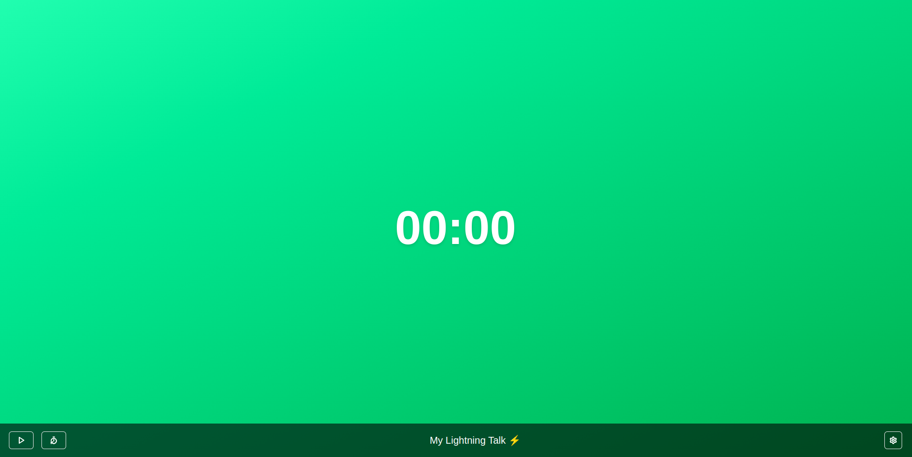
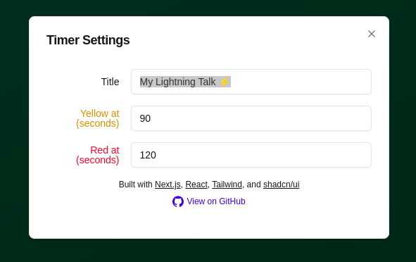

<p align="center">
  <h1 align="center">TALK TIMER</h1>
</p>

<h3 align="center">A simple timer for talks, with configurable time for warning and end of talk.</h1>

<div>
  
</div>

  <h2 id="About-project" align="center">⚡️ About the Project</h2>

<div>
  <p>
    This is a simple timer that can be used during speech or competition to mark timings. The default configuration is:
    <ul>
      <li>Title: My Lightning Talk ⚡</li>
      <li>Yellow Threshold: 90</li>
      <li>Red Threshold: 120</li>
    </ul>
  </p>
  
</div>
<div>
  <p>When the timer reaches the Yellow threshold, the color is immediately changed to Yellow</p>
  
</div>
<div>
  <p>When the timer reaches the Red threshold, it means the time is almost up. Manually uou would need to pause it and refresh it</p>
  
</div>
<br />

  <h2 id="tech-stack" align="center">⚡️ Tech Stack</h2>

### Frontend Technology
NextJS + shadcn/ui

### Deployment Platform
Vercel


  <h2 id="quick-setup" align="center">⚡️ Quick Setup</h2>

### Fork the project

Fork the project in github

### Clone the forked repo
1. Copy the SSH link
2. Run the following command to clone from your forked repository.

```bash
git clone git@github.com:your-username/talk-timer.git
```
Note: replace `your-username` with your actual Username

### Install Dependencies

Since this application is built using NextJS, install the npm dependencies:

```bash
npm install
# or
yarn install
# or
pnpm install
# or
bun install
```

### Run the code

```bash
npm run dev
# or
yarn dev
# or
pnpm dev
# or
bun dev
```

The code will run in the default port 3000.

  <h2 id="contributing-guidelines" align="center">⚡️ Contributing Guidelines</h2>
<p>
  Please refer the CONTRIBUTING.md file for contribution guidelines
</p>